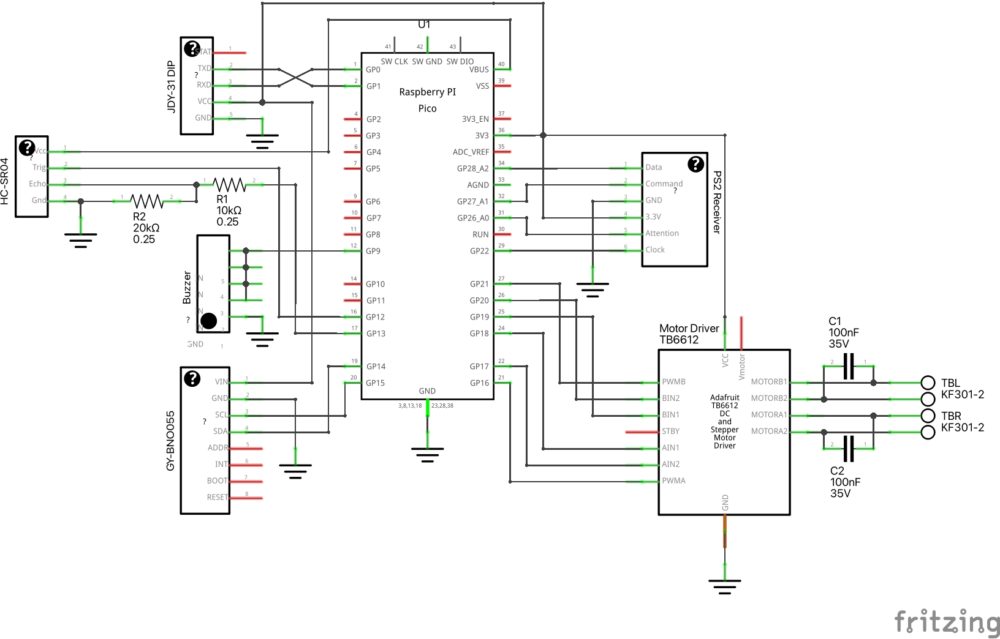

## Features

- My own tiny asynchronous event loop (since [CircuitPython doesn't have one](https://learn.adafruit.com/welcome-to-circuitpython/frequently-asked-questions))
- Custom «asynchronous» BNO055 driver
- Multiple asynchronous tasks running «at the same time»
- Schematics & PCB design included

## Parts

- [Raspberry Pi Pico](https://www.raspberrypi.org/products/raspberry-pi-pico/)
- [Adafruit TB6612 Motor Driver Breakout Board](https://learn.adafruit.com/adafruit-tb6612-h-bridge-dc-stepper-motor-driver-breakout)
- JDY-31 Bluetooth Module
- VL53L1X Distance Sensor Breakout
- BNO055 Absolute Orientation IMU Fusion Breakout
- PS2 Wireless Receiver
- Piezo Buzzer

## Schematics

