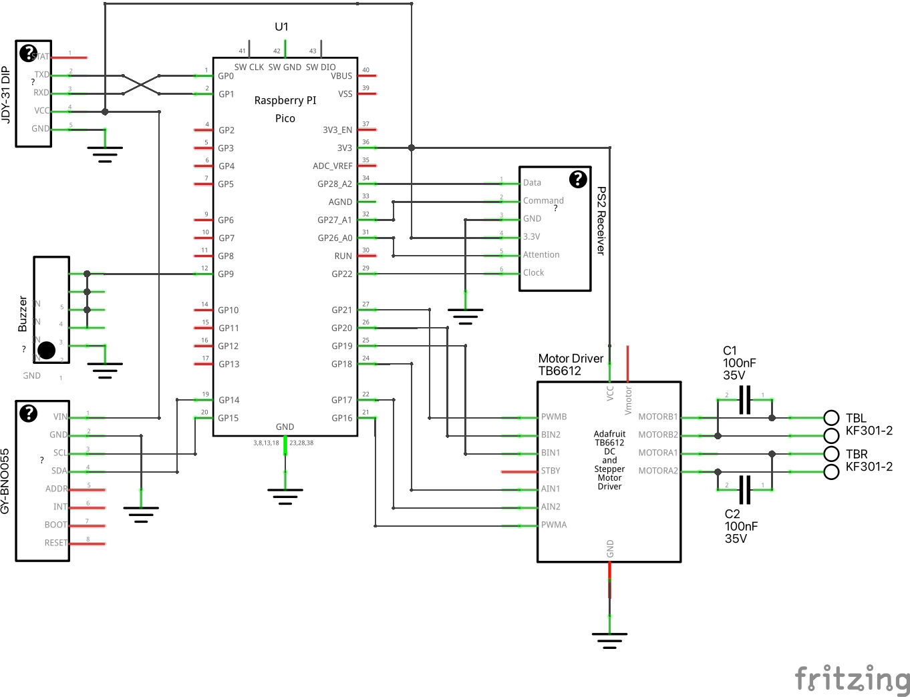

**I'm switching from Arduino Nano Every to Raspberry Pi Pico. The schematics and PCB are almost ready, but the code isn't updated yet.**

## Parts

- [Raspberry Pi Pico](https://www.raspberrypi.org/products/raspberry-pi-pico/)
- [Adafruit TB6612 Motor Driver Breakout Board](https://learn.adafruit.com/adafruit-tb6612-h-bridge-dc-stepper-motor-driver-breakout)
- JDY-31 Bluetooth Module
- [HC-SR04 Ultrasonic Distance Sensor](https://www.sparkfun.com/products/15569)
- BNO055 Absolute Orientation IMU Fusion Breakout
- PS2 Wireless Receiver
- Piezo Buzzer

## Schematics

